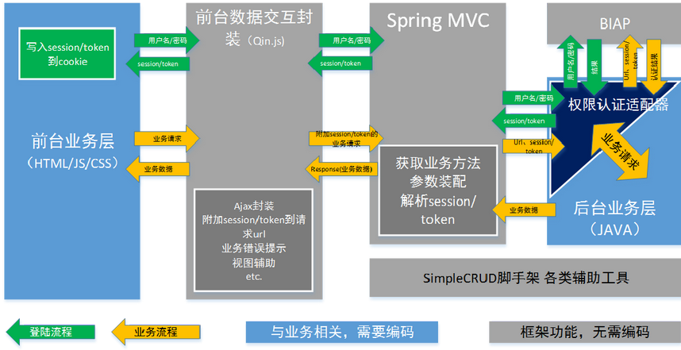

# What's Qin Framework

JVM平台的跨终端快速开发框架，基于Spring MVC、Spring Data，JQuery。

设计原则：
跨终端：服务与视图除上传下载文件外仅能通过基于JSON的Restful API交互，视图层只用纯粹的HTML+CSS+JS技术；
快速开发：Spring Data JPA做持久化，实现SimpleCRUD脚手架，简单的操作让框架代劳，让开发更聚焦具体业务；
美工友好：视图只用标准的前端技术，没有服务端代码污染，前端Mock功能，使美工可模拟真实操作。

# 与传统SSH框架的区别

## 优势
1. 使用Spring MVC替换Struts2，Spring MVC的性能优于Struts2且配置简单（基于注解）与Spring整合更简单
1. 使用Spring Data JPA做持久化，Spring Data JPA包装了Hibernate，操作上更简单
1. 通过基于JSON的Restful API与前端交互，更有利于前后台分离
1. 前台只用纯粹的HTML+CSS+JS技术，更标准，对美工更友好

## 注意点
1. 命名区别：Struts2的action在Spring MVC中叫controller，dao在 Spring Data叫repository
1. Struts2的action是多实例，线程安全的，所以可以使用成员变量， Spring MVC的controller为单列，尽量避免使用成员变量

# Step By Step

1. 创建Maven项目projectX
1. 添加Qin依赖

        <dependency>
            <groupId>com.zjhcsoft</groupId>
            <artifactId>qin</artifactId>
            <version>[1.0,2.0)</version>
        </dependency>

1. 复制Qin项目中目录 `webapp\qin`  `resource\`  到projectX对应的目录
1. 修改 `resources\qin-config.properties`  的配置信息，此文件包含了数据库连接等后台信息
1. 修改 `webapp\index.html`  中的  `window.location='shreport/index/index.html'`  使其指向项目首页
1. 在项目前台目录中新建全局js文件（建议目录及名称：`webapp\projectX\common\base.js`），添加示例如下信息：

        var Base = function () {
            function _init() {
                //前台配置
                Q.load({
                    isDevEnv: true,
                    webContext: '/report',
                    baseAjax: '/report/api',
                    tokenName: '_token',
                    page401: '/report/shreport/login/login.html'
                });
                //一些项目共用的css及js
                //document.write('<link href="' + Q.config.webContext + '/shreport/common/base.css" rel="stylesheet" type="text/css"\/>');
                //document.write('
        
        

# Q&A

## 如何与BIAP整合

与BIAP的整合通过Web Service，推荐使用Jax-WS，分两步：

1.  扩展BaseAuthedInfo类，添加项目要关注的认证实体字段，可以是标准的bean也可以是一个不可变对象，如：

        public class BIAPAuthedInfo extends BaseAuthedInfo {
            public String userName;
            public String roleId;
            public String roleName;
            public String areaId;
            public String areaName;
            public String postId;
            public String postName;
        }

1.   实现RestfulSecurityAdapter接口，一定要用@Service注解，如：

        @Service
        public class SecurityAdapterService implements RestfulSecurityAdapter<BIAPAuthedInfo> {
            @Override
            public BIAPAuthedInfo login(Map<String, String> authInfo) {
                String userName = authInfo.get("userName");
                String password = authInfo.get("password");
                if (null == userName || "".equalsIgnoreCase(userName.trim()) || null == password || "".equalsIgnoreCase(password.trim())) {
                    return null;
                }
                try {
                    UserInsideProxy userInsideProxy = authAccessor.authUser(userName.trim(), MD5.str2MD5(password.trim()), null);
                    BIAPAuthedInfo biapAuthedInfo = new BIAPAuthedInfo();
                    biapAuthedInfo.PK = userInsideProxy.getLoginName();
                    biapAuthedInfo.userName = userInsideProxy.getUserName();
                    //其它字段映射
                    return biapAuthedInfo;
                } catch (Exception e) {
                    logger.error("Login Error.", e);
                }
                return null;
            }
            @Override
            public boolean logout(BIAPAuthedInfo authedInfo) {
                return true;
            }
            @Override
            public boolean auth(HttpMethod httpMethod, String uri, BIAPAuthedInfo authedInfo) {
                if (null == authedInfo) {
                    return false;
                }
                return true;
            }
        }

## 如何登录/注销/获取登录信息

1. 默认登录URL：GET qin/auth/login/?userName=<userName>&password=<password>
2. 默认注销URL：GET qin/auth/logout/
2. 默认获取登录信URL：GET qin/auth/loginInfo/

## 如何使用Simple脚手架

对于简单的CRUD操作可使用框架提供的Simple脚手架实现，整合流程如下：

1.新建 entity

        @Entity
        public class Organization extends SecurityEntity {
            @Column(nullable = false)
            private String name;
            public String getName() {
                return name;
            }
            public void setName(String name) {
                this.name = name;
            }
        }

1. 新建 repository，继承 BaseRepository

        public interface OrganizationRepository extends BaseRepository<Organization> {
        }

1. 新建 service ，继承 SimpleServiceImpl

        @Service
        public class OrganizationService extends SimpleServiceImpl<OrganizationRepository, Organization> {
        }

1. 新建 controller , 继承 SimpleController

        @RestController
        @RequestMapping("organization")
        public class OrganizationController extends SimpleController<OrganizationService, Organization> {
        }

1. 完成，这样前台就可以做CRUD操作，对应的uri如下

         添加组织：Q.ajax.post('organization',<数据>,successCallack)
         获取组织：Q.ajax.get('organization/<code>',successCallack)
         更新组织：Q.ajax.put('organization/<code>',<数据>,successCallack)
         删除组织：Q.ajax.del('organization/<code,多个请用，分隔>',successCallack)

##  SimpleController 与  SimpleVOController 的区别
当存在VO（即entity无法满足前台要求）时使用  SimpleVOController 返回 使用  SimpleController。

## 如何持久化

本框架使用Spring Data，请参照相关文档。

## 前台如果与后台交互

前台的主要文件为Qin.js，命名都以Q开头，与后台交互使用Q.ajax下的方法，常用方法有Q.ajax.get/post/put/del，对应的是获取/添加/更新/删除资源的操作，另外也提供了对应同步方法：Q.ajax.getSync/postSync/putSync/delSync

# 最佳实践

Check out `http://134.96.82.19/svn/qin/demo`

